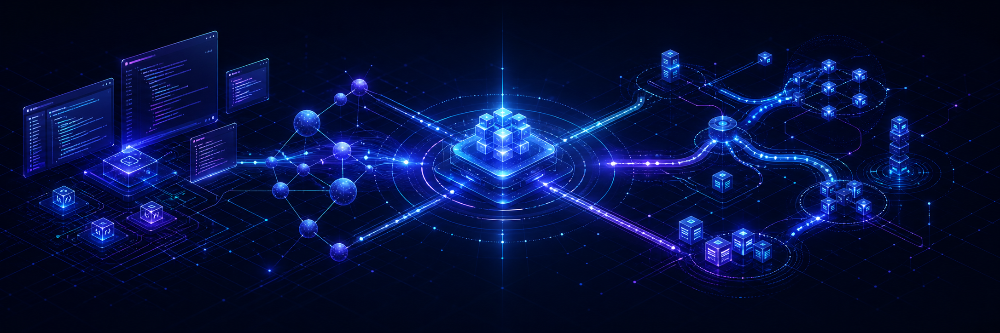

  

<h1 align="center">saturnone1</h1>

  <strong>Windows &amp; .NET engineer building AI developer tools and distributed systems</strong> 
  Visual Studio extensions · MCP integrations · DDS · NATS · gRPC · RAG

  Windows/.NET 기반 AI 개발 도구와 실시간 분산 시스템을 만들고 있습니다.

  
  
  
  
  
  

  
  
  
  
  
  

## Focus

| AI developer tooling | Distributed systems | Engineering delivery |
| --- | --- | --- |
| Visual Studio extensions, local-first assistants, MCP servers, and RAG services | DDS/RTPS, NATS, gRPC, real-time messaging, and Kubernetes networking | Reproducible builds, offline deployment, validation automation, and explicit architecture |

## Featured projects

| Project | What it demonstrates |
| --- | --- |
| **[Signal Forge](https://github.com/saturnone1/Signal-Forge)** | DDS, NATS, and gRPC integration workbench for developing, testing, and automating distributed messaging workflows. |
| **[Cline for Visual Studio 2022](https://github.com/saturnone1/Cline_for_VisualStudio_2022_17.12)** | Cline-style AI coding agent with a VSIX host, WebView2 UI, Node.js sidecar, and shared packaging for Visual Studio 17.0 and 17.12. |
| **[VS MCP Server for Visual Studio 2022](https://github.com/saturnone1/vs_2022_mcp)** | MCP server port adapted for Visual Studio 2022 17.12 and .NET 9. |
| **[MCP Server Bundle](https://github.com/saturnone1/MCP-Servers-LIG)** | C#/.NET MCP servers spanning developer tools, databases, infrastructure, and Windows engineering applications. |
| **[DDS Discovery Service](https://github.com/saturnone1/DDS_Discovery_Service)** | Active-active RTPS/SPDP relay for RTI Connext DDS participants in Kubernetes networks without reliable multicast discovery. |
| **[LIGClaw](https://github.com/saturnone1/LIGClaw)** | Local-first Windows assistant architecture using WPF, a Node.js sidecar, and versioned JSON-RPC IPC. |

<strong>More work</strong>

- [Link16 RAG](https://github.com/saturnone1/Link16_RAG) — .NET 9 REST RAG service with SQLite-backed retrieval and source-grounded responses.
- **DDSClient** *(private)* — unified Windows and Linux build, validation, and packaging workflows for a cross-platform DDS client.

## How I build

- Keep runtime boundaries explicit and components independently testable.
- Prefer reproducible, offline-friendly builds over machine-specific setup.
- Treat validation, packaging, and operational documentation as product features.
- Preserve project history while making active ownership and compatibility clear.

  Building practical tools at the intersection of IDEs, AI agents, and real-time distributed systems.

